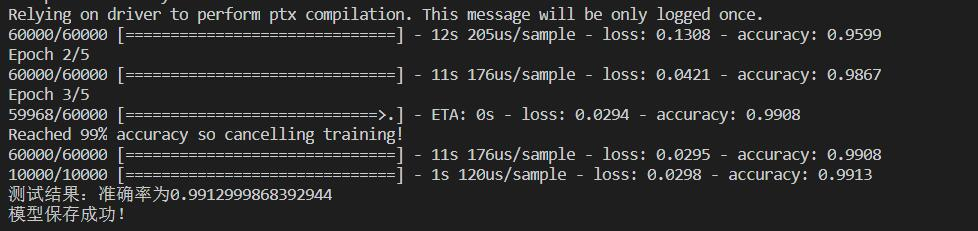
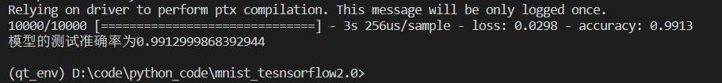
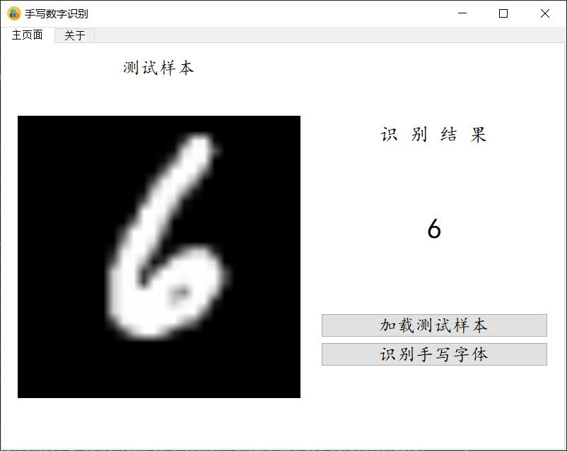

# 手写字体识别-基于tensorflow2.0实现
手写字体识别是卷积神经网络的入门案例，这里我将模型的训练、测试、保存以及使用整合在了一起，至于原理部分，大家可以参考知乎或者B站上的回答，在这里我就不赘述了, 或者关注我的微信公共号，我会不定期更新一些编程干货。


## 文件目录
```bash
|--images 图片的存放目录，这里我放置了一些图片用于装饰界面
|--models 模型的存放目录，训练好的模型将会存放在这个文件夹下
|--train.py 模型的训练代码，直接执行将会保存模型到models文件夹下
|--test.py 模型的测试文件，计算模型的准确率，或者你可以使用这个文件来进行单一文件的测试
|--minist_window.py 可视化界面，在这个界面下，你可以进行可视化的操作来完成手写数字的识别
|--requirements.txt 执行环境中必备的包
```

## 如何使用
首先你需要git项目到你的本地

确定你的电脑已经安装好了PyQt5、tensorflow2.0以及opencv-python等相关软件，你可以执行下列命令进行安装
```
cd mnist_tensorflow2.0
conda create -n mnist_demo 
pip install -r requirements.txt
```

如果你想要重新训练你的模型，请执行
```
python train.py
```
如果你想要测试模型的准确率，请执行
```
python test.py
```
如果你想看看图形化的界面，请执行
```
python mnist_window.py
```


## 执行效果
训练效果


测试效果


图形化界面


## 捐助
如果您觉得我的项目帮助了您，您可以给我一点小小的鼓励，您的鼓励将会是我进一步创作的动力！😁😁😁

 
